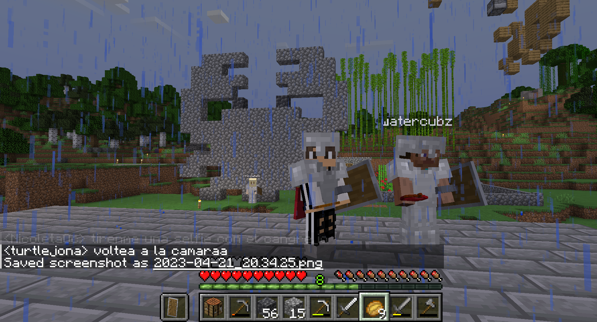

# Dia 1 en Nimbus

Querido journal, el dia de hoy pasaron bastantes cosas en el servidor, 
primeramente me recibieron con mucho entusiasmo y empece mi dia organizando mis cofres esperando que todo estuviera bien.... pero me encuentro con la desagradable sorpresa de que _alguien_ habia robado mi cama pero aparentemente ninguno de los compañeros del server había sido.

Me pareció muy sospechoso pero prosegui con mi camino, me propuse conseguir
una nueva cama, por ello me adentre en la densa jungla que esta al lado de nuestra
base, pero me encontre con que se estaba incendiando por ello comence a apagar
el fuego :fire: con mi espada de piedra, logre que no se propagara pero en el proceso
me perdi en los alrededores, aunque encontre lana pero se volvio de noche y regrese 
a la base, entonces concluido eso, quise ir a minar para buscar diamantes :diamonds:.

Por ello les mencione a [Tali](https://github.com/TaliAly) y a [Midnight](https://github.com/TheMidnightShow) 
que si me acompañaban a minar a lo que dijeron que si, nos adentramos en la guarida de Mid
y parecia oscura, aterradora, pero bastante `interesante` parecia una baticueva, 
me estoy desviando, fuimos a lo mas profundo donde me dijo que buscara diamantes
y yo feliz en la capa -59 listo para recolectar.

Pero... ._. no tenía hierro para picar los diamantes, a lo que Midnight que es 
muy buen amigo me regalo no uno **sino dos picos de hierro** y luego de un rato 
recolecte diamantes y pude hacer un tocadiscos jaja 

Luego por la tarde regrese a mi casa hecha con bloques de piedra tallada, 
tomo mucho tiempo hacer esa casa para el tiempo que paso ahí, _anyway_
despúes saludo a Watercubz.

Y me propongo antes de acabar el dia hacer un monumento a la 
mascota no oficial del lenguaje Rust **#noMeDemandesRustFoundation** 
entonces me dispuse a ver un tutorial y me encontre con uno bueno
despues de unos 30 min, se anochece y continuo el dia siguiente, termino la obra
y decido tomarle captura y ademas poner un cartel que indicara que ese 
monumento ahora era patrimonio del server.

- Espero que dure mas de un día ese monumento, en fin, hasta aquí llego mi reporte.

Adios, Atte. Turtlejona :turtle:

