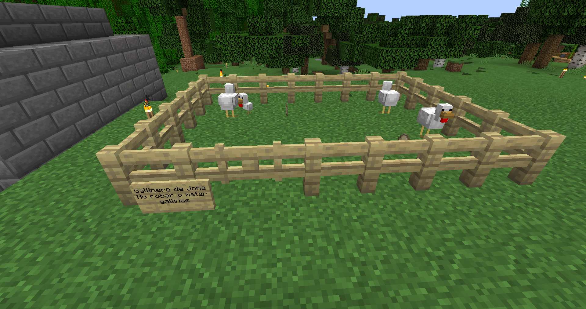
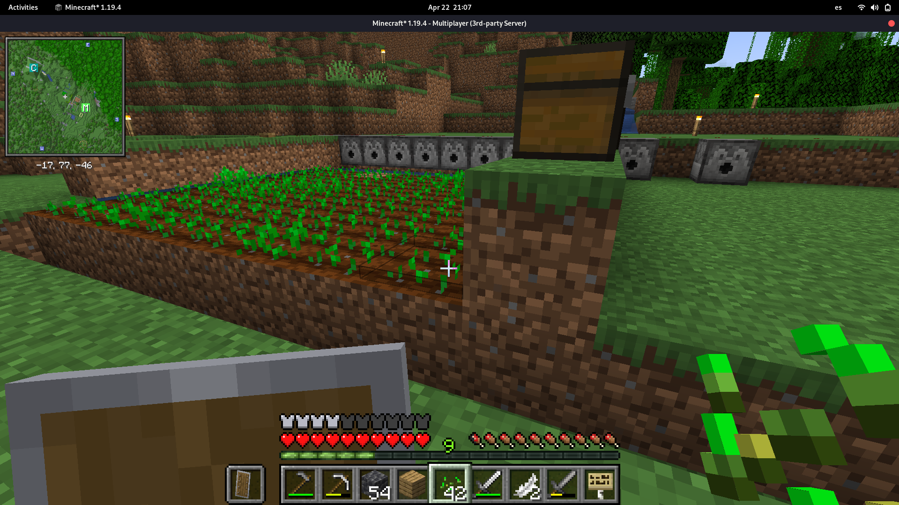
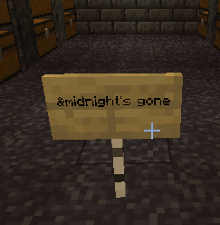
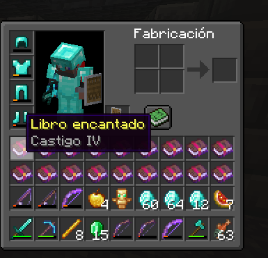
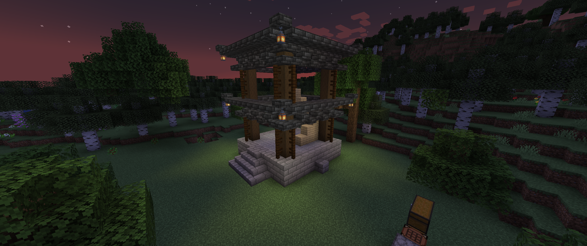

Dia 2 en el paraiso de la tierra desolada dominada por la mafia y el crimen. 

Empieza el dia normal y no pasan 5 minutos de que llego y Watercubz me quiere correr de mi hogar por no pagar la renta, digo porque mi casa se 
convertira en un gallinero, a lo que yo le respondo enojado que no me ire, pero pienso en la idea de mudarme a las cercanias de la casa cueva de Midnight.

Despúes Tali :crown: se autoproclama reina del mundo de Stratus, a lo que todos desertamos y no estamos deacuerdo y la dejamos que siga con sus aires de grandeza, porque en todos lados quiere mandar esa mujer.

Ante esto Rick trata de conquistarla con sus diamantes que mino porque le dio de repente un setido de trabajador obrero y mino 2 slots de diamantes, aprox. 80 pero Tali ni presto atención.

Luego me dispuse a explorar un poco y me dieron ganas de hacer un gallinero, empezamos con un nuevo proyecto, que me sacaria de Latinoamerica y lograría el sueño americano, **Un Rancho**, busque y busque y al final traje 2 gallinas, los encerre y puse un aviso muy claro sobre que *son mis gallinas* y nadie les puede hacer nada

Intento eliminar a un pollo para hacerme un rico asado bien chopeadito pero me mira con culpa y se me pasa.

Entonces luego encuentro un plantio de Maiz sin dueño y lo corto pero les dejo en un cofre el maiz que logre obtener y solo me voy con unos 20 como paga.
> Espero no se moleste el sembrador

Despues me entero de la peor noticia, que **Midnight** mi gran amigo y compañero nos abandono y dejo toda su base, le heredo los terrenos a Rick, ahora andaba luchando por sobrevivir.

Pero no me preocupa, el regresara *o talvez no* pero no morira, es un crack. Despúes de esta terrible noticia, Rick siguió trabajando como un campeón talvez para luchar contra por la perdida de Midnight, y se cheto hasta los dientes

_Ya no se si se prepara para una guerra o para conquistar a Tali_

Luego Midnight se reporta que se encuentra excelete, fresco como lechuga y nos manda lo que hizo a 18k de bloques de distancia

Y eso fue lo que ocurrio el dia de hoy en Stratus, _cambio y fuera_.

atte. turtlejona :turtle: